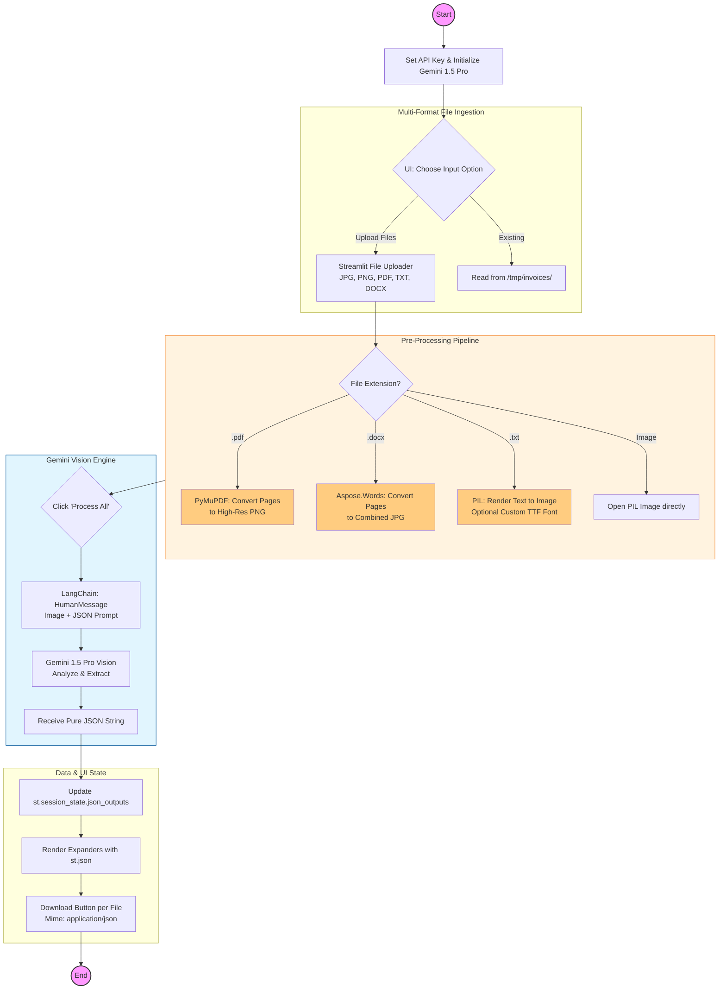

# 🧾 Intelligent Invoice Data Analyzer

An enterprise-grade **Vision-AI** application that automates the extraction of structured data from diverse document formats. Powered by **Gemini 1.5 Pro**, this tool converts complex visual information into machine-readable **JSON**, supporting bulk processing of images, PDFs, Word documents, and text files.

---

## 🏗️ System Architecture

The application utilizes a **Multimodal Document-to-Image Pipeline**, where all incoming data formats are normalized into high-resolution images before being analyzed by the LLM's vision reasoning layer.

### 1. Format Normalization Layer
To ensure the highest extraction accuracy, the system converts every input type into a visual format:
* **PDF to Image:** Uses `PyMuPDF (fitz)` with a high-resolution matrix zoom (2.0x) to preserve small text clarity.
* **DOCX to Image:** Employs `Aspose.Words` to render Word pages into high-fidelity JPEGs, which are then stitched into a single vertical canvas using `PIL (Pillow)`.
* **TXT to Image:** Synthesizes a virtual document using a custom `.ttf` font engine to ensure the AI "sees" the text as a formal document structure.

### 2. Vision Reasoning Layer (Gemini 1.5 Pro)
* **Spatial Analysis:** Unlike traditional OCR that reads line-by-line, the Vision-AI understands the **spatial relationship** of data (e.g., identifying "Total" because it is at the bottom right of a table).
* **Zero-Shot Extraction:** Uses a specialized system prompt to enforce a "Pure JSON" output, bypassing the need for manual regex parsing or template definition.

### 3. Orchestration & State Management
* **Volatile Caching:** Uses a temporary directory (`/tmp/invoices/`) to manage intermediate image assets, with built-in cleanup logic.
* **Session Persistence:** Leverages `st.session_state` to store processed JSON outputs, allowing users to review and download results for multiple files without losing data.

---

## 🛠️ Tech Stack

| Component | Technology |
| :--- | :--- |
| **Vision Model** | Google Gemini 1.5 Pro |
| **App Framework** | Streamlit |
| **PDF Processing** | PyMuPDF (fitz) |
| **Office Docs** | Aspose.Words & python-docx |
| **Imaging Engine** | PIL (Pillow) |
| **JSON Handling** | Python `json` & `time` modules |

---

## 🧠 Logic & Workflow

1.  **Ingestion:** User uploads a batch of files (IMG, PDF, DOCX, TXT).
2.  **Conversion:** The system routes each file through its respective converter to generate a `.png` or `.jpg` artifact.
    
3.  **Vision Prompting:** A `HumanMessage` is constructed containing both the image and a strict JSON schema instruction.
4.  **Inference:** Gemini Pro analyzes the visual layout and returns a structured dictionary.
5.  **Review:** Results are displayed in interactive JSON expanders with individual download capabilities.

---

## 📊 Technical Specifications

### Multi-Page Stitching Logic
For multi-page DOCX files, the system calculates the cumulative height of all pages and creates a single unified image. This allows the LLM to process the entire document context in one single "glance," which is critical for invoices that span multiple pages.

### Custom Font Rendering
When converting raw TXT files to images, the application supports **Dynamic Font Injection**. This allows the user to upload specific `.ttf` files to mimic brand-specific invoice styles, which can improve extraction accuracy for highly stylized text.

```python
# Unified image creation logic
combined_image = Image.new('RGB', (total_width, total_height))
y_offset = 0
for image in images:
    combined_image.paste(image, (0, y_offset))
    y_offset += image.height
```
## Logic Flowchart

    
### Prompt Guardrails
The application uses a **Negative Constraint** in its prompt to prevent the LLM from wrapping the output in Markdown blocks:
> *"Your response shall not contain ' ```python ' and ' ``` ' ... get the output in pure json"*

This enables the use of `json.loads()` directly on the response string for a seamless data flow.
